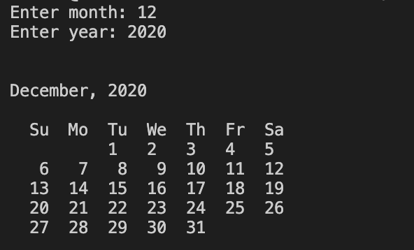
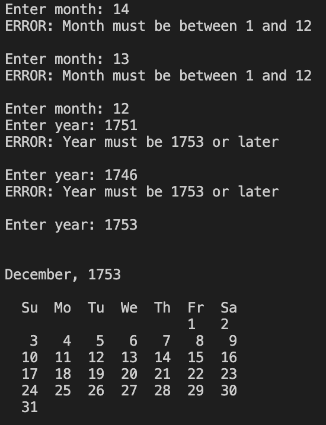

# Calendar Program
## Description:
This program is for creating calendars by month for any year after 1753 (the year the calendar was standardized). It is to help you plan out your month/year. This progam is straightforward when it is running. Simply put in the month number and the year. Error checking is done on the user's input. Once the month and year has been entered the calendar for that month and year will be displayed.
## Execution:
Installation of this program is simple. Simply download the file calendar.py. When ready, go to your terminal or command line and type in the command `python` followed by the location and name of the file for example: 

``` python /Users/****/Documents/Git/calendar/calendar.py```

should run the file on my computer because I used the location of the file after the command `python`.

# Photos
## Regular Output:



## Error Handling:


# Useful Websites
* [For Loops (python wiki)](https://wiki.python.org/moin/ForLoop)
* [Stack Overflow Question](https://stackoverflow.com/questions/12032214/print-new-output-on-same-line)
* [Range() function](https://www.w3schools.com/python/ref_func_range.asp)